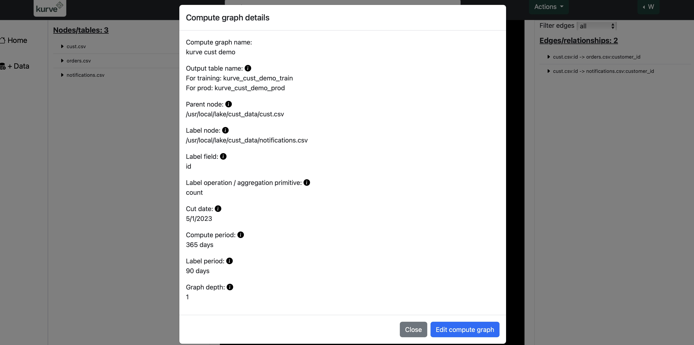
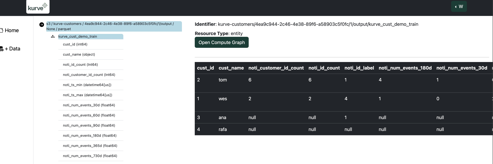
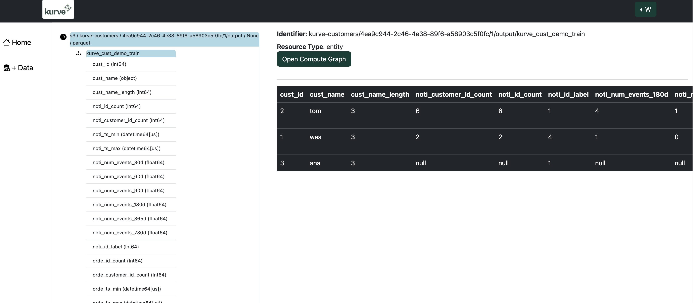
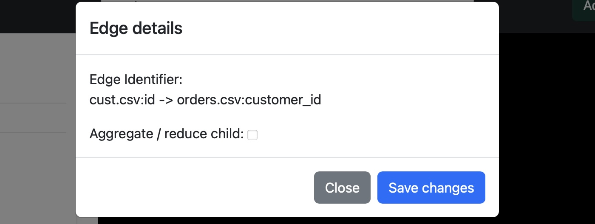
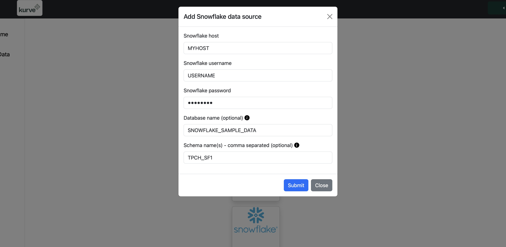
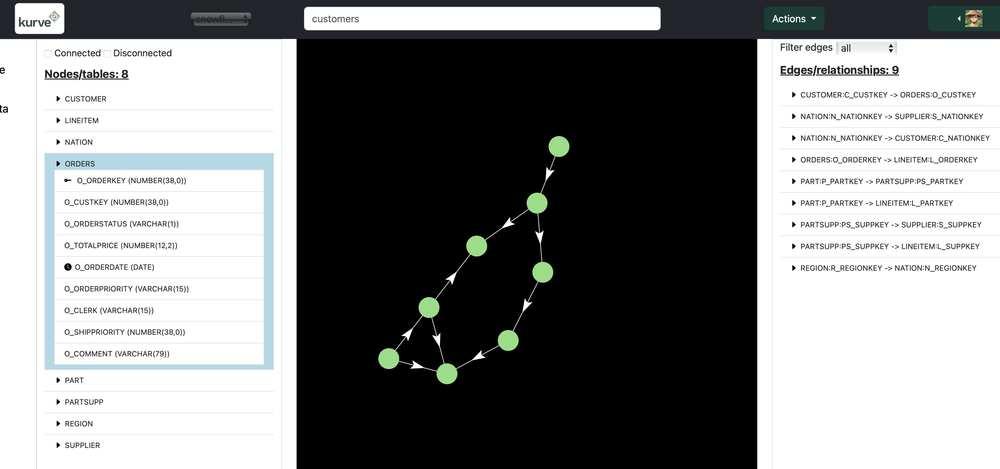
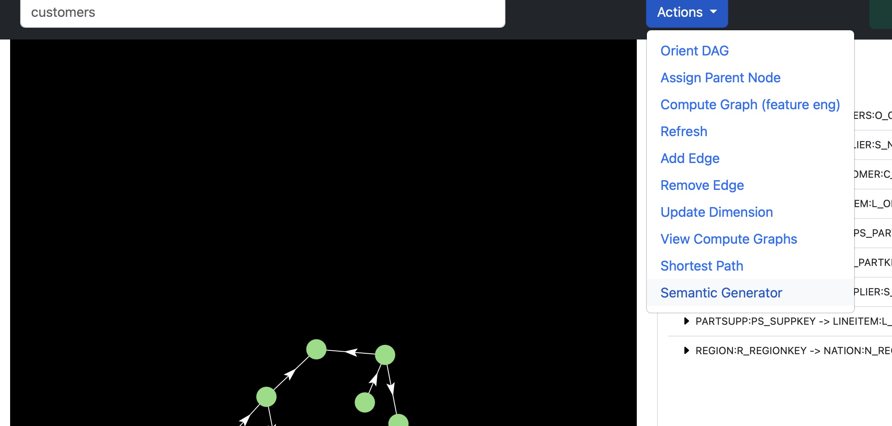
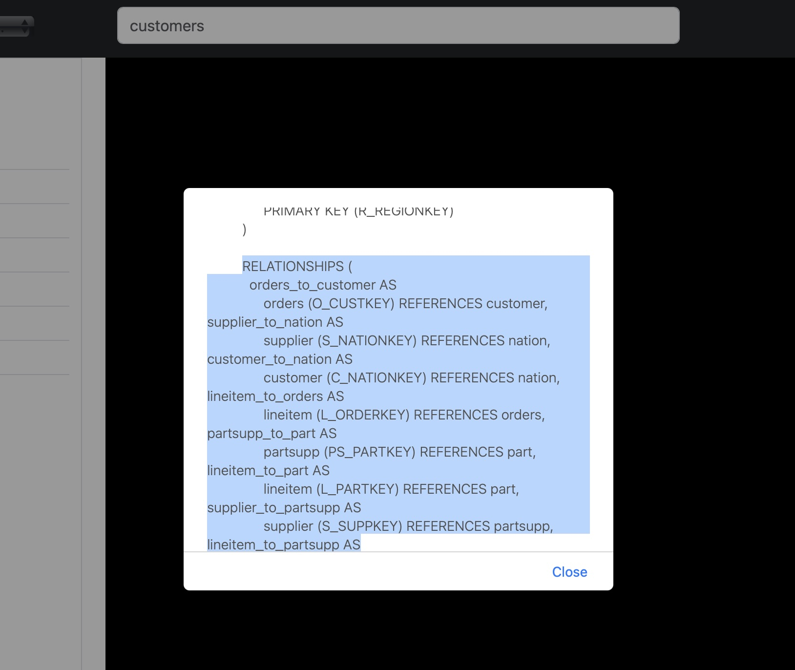
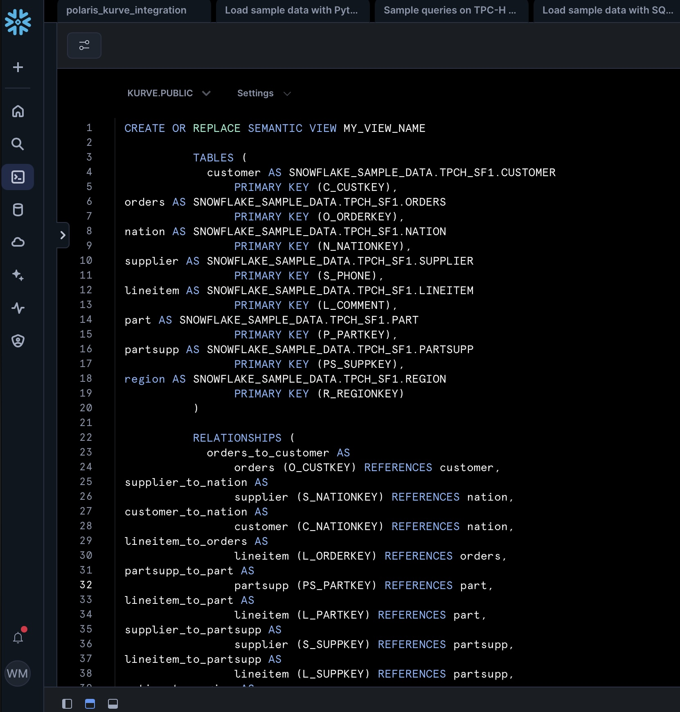

## Relational schema inference
This tutorial covers the basic features of extracting relational metadata
from a directory of files.  The same process would be followed for a data lake / data warehouse.

1. Log in to [kurve demo](https://demo.kurve.ai)
2. Look under <b>Sample data sources</b> for `/usr/local/lake/cust_data` and click <b>Create Graph</b>
3. In a few seconds the page should refresh and you can view the graph by clicking <b>View Graph</b>
4. View all of the foreign key relationships between the 6 tables:
    1. `cust.csv` connects with `orders.csv` on `id -> customer_id`
    2. `cust.csv` connects with `notifications.csv` on `id -> customer_id`
    3. `orders.csv` connects with `order_products.csv` on `id -> order_id`
    4. `notifications.csv` connects with `notification_interactions.csv` on `id -> notification_id`
    5. `notification_interactions.csv` connects with `notification_interaction_types.csv` on `interaction_type_id -> id`

In this example Kurve points at the 6 csv files, runs an algorithm, and extracts all of the relational metadata.
Next we'll look at how to run computation on these relational metadata graphs.


## Orienting schema graphs around particular nodes
Most analytics and AI problems are oriented around a particular [dimension](https://en.wikipedia.org/wiki/Dimension_(data_warehouse)).  With a graph structure we can easily manipuate the schema graph
around the dimension of interest.  For this example we'll orient the `/usr/local/lake/cust_data`
sample schema around the `cust.csv`.  To do this we'll assign the `cust.csv` as the <b>parent node</b>:

1. Under <b>Actions</b> in the schema graph viewer click <b>Assign Parent Node</b> and select `cust.csv` with `depth=1`.
2. You should have a subgraph of 3 tables now: `cust.csv`, `orders.csv`, and `notifications.csv`
3. Now that we've oriented the dataset around the `cust.csv` dimension let's get to compute / data integration.


## Compute graph basics
1. Visit the schema graph for `/usr/local/lake/cust_data`.
2. Click <b>Actions</b>, <b>Assign Parent Node</b>, select `cust.csv` with `depth = 1`.
3. Click <b>Actions</b>, <b>Compute Graph</b> and plug in the following values:
    1. Name: kurve cust demo
    2. Parent Node: cust.csv
    3. Depth limit: 1
    4. Compute period in days: 365
    5. Cut date: 05/01/2023
    6. Label period in days: 90
    7. Label node: notifications.csv
    8. Label field: id
    9. Label operation: count

4. Notice the color coating of the parent node, cust.csv, and the label node, notifications.csv.
5. Let's make sure our parameters are correct: click <b>Actions</b>, <b>Show compute graph details</b>.  Here is what it should look like:

6. If all of that looks good now let's execute the compute graph:
    1. click <b>Actions</b>
    2. click <b>Execute compute graph</b>
    3. navigate home
    4. you should now see a data source under <b>My data sources</b>, click it and find the `kurve_cust_demo_train` table or whatever name you used and click on the table
    5. notice all of the columns but we should only have 4 rows, this is all 3 tables aggregated and integrated to the `cust.csv` dimension with point-in-time correctness based on the above parameters.



## Node-level operations customization (basic)
In the compute graph created in the above example we leaned into Kurve's automation, but let's
customize some things and see the effect.

1. Visit the compute graph under `/usr/local/lake/cust_data`

2. Click the parent node `cust.csv`

3. Click <b>Edit Node</b> and under <b>Annotations / special selects</b> enter the following:

    ```
    select *, length(name) as name_length
    ```

4. Under <b>Filters</b> enter the following:

    ```
    where name_length < 4
    ```

5. Execute the compute graph
6. Navigate home and click on the compute graph output table under <b>My data sources</b> and you shuld now see only 3 rows.


In summary, we annotated the `cust.csv` node with a new column called `name_length` and then filtered the dataset to only contain rows where `name_length < 4`, which filtered one row.  This highlights how we can customize compute graphs in a basic way.  The next example will do this in a more advanced way.


## Node-level operations customization (advanced)
Continuing with the same schema and compute graph from the prior examples.

### post-join annotation
We need to compute the difference between the `notifications.csv` and the `orders.csv` timestamps, which will require
they both be joined to the `cust.csv` and then a `DATEDIFF` operation needs to be called between the dates.  The order
of operations is as follows:

1. Join `orders.csv` to `cust.csv` without aggregating
2. Join `notifications.csv` to `cust.csv` without aggregating
3. Compute date difference between `orders.csv` timestamp and `notifications.csv` timestamp

To accomplish this in Kurve we just need to specify a post-join annotation definition on the `cust.csv` as follows:


Notice the highlighted portion of the screenshot which shows the nodes that the `post-join annotate` operation depends on.  This tells Kurve that to apply the defined operation under post-join annotate we need bboth the `orders.csv` and `notifictions.csv` merged first.  The SQL we're running is:
```sql
select *,
DATEDIFF('DAY', ord_ts, not_ts) as order_notification_timediff
```

Additionally, we need to update both edges to <i>not</i> be aggregated prior to join:


Finally, we can execute the compute graph.  Once it is executed notice the newly added column in the dataset.  Also notice that we don't have just 4 rows anymore since we did not aggregate the child relationships!


### post-join filters
In post-join annotation we created a new column that depended on 2 foreign relationships.  We'll define a filter which depends on the same 2 relationships and applies to the column created by post-join annotate.


Now re-execute the compute graph and view the output.  There shouldn't be any negatives for `order_notification_timediff`:


## Snowflake semantic views
We're using the `SNOWFLAKE_SAMPLE_DATA.TPCH_SF1` database for this example, which is in all Snowflake accounts.  This is also one of the data sources used in the [Snowflake semantic views](https://docs.snowflake.com/en/user-guide/views-semantic/overview) documentation.

### Connect snowflake source
Navigate to the data sources section of Kurve and add the Snowflake data source as shown in the screenshot:


### Infer relationships between snowflake tables
After adding the Snowflake data source we can see it under <b>My data sources</b> in the homepage.  Now we'll go ahead and click <b>Create graph</b> to have Kurve infer all of the primary keys, foreign keys, and date keys between tables:


### Inspect Kurve metadata graph output
After Kurve finishes running we can open the metadata graph and view what it extracted:

* Notice the icons next to the columns of the `ORDERS` table in the image.
* It looks like Kurve selected `O_ORDERKEY` as the primary key and `O_ORDERDATE` as the date key.
* Notice the relationships / edges on the right hand side.
* These are what we'll use to dynamically generate the Snowflake semantic view



### Generate the Snowflake Semantic View
Under <b>Actions</b> you will see <b>Semantic generator</b> if the data source is Snowflake:


After executing a pop up will return with the semantic view pre-populated with all:
- primary keys for all tables in the graph
- relationships for all tables in the graph
- metrics, dimensions, and facts are left for the user to define


Finally, we can copy/paste this into Snowflake, add final modifications, and execute:

